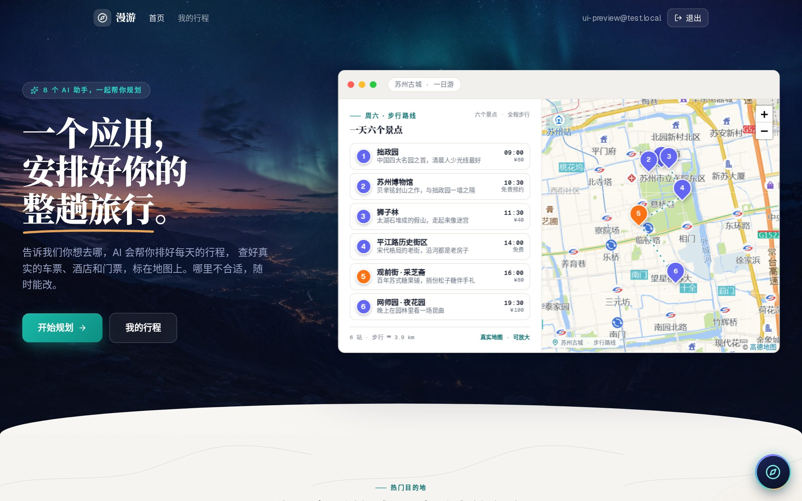
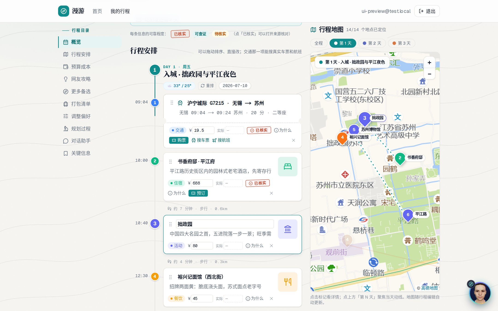
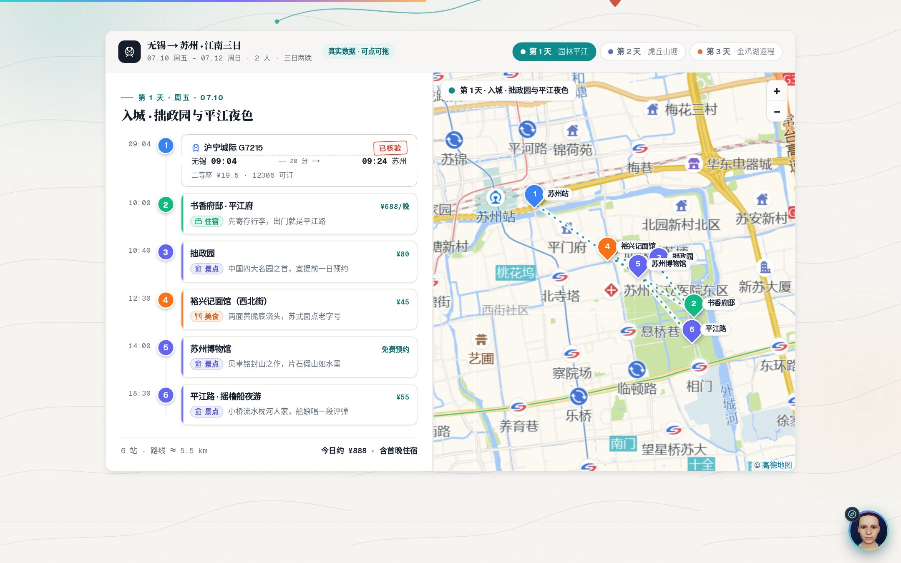
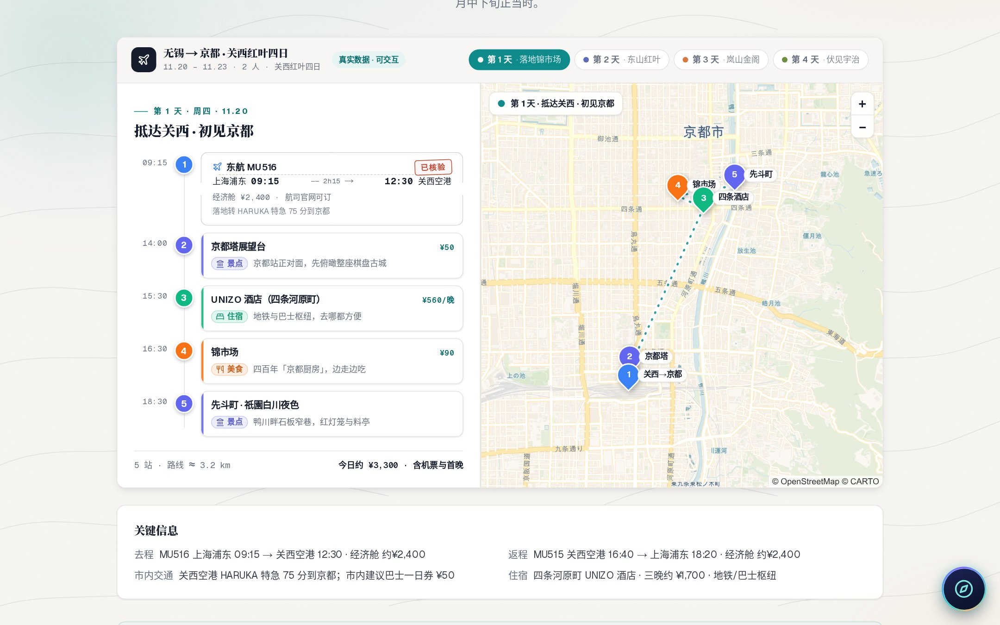
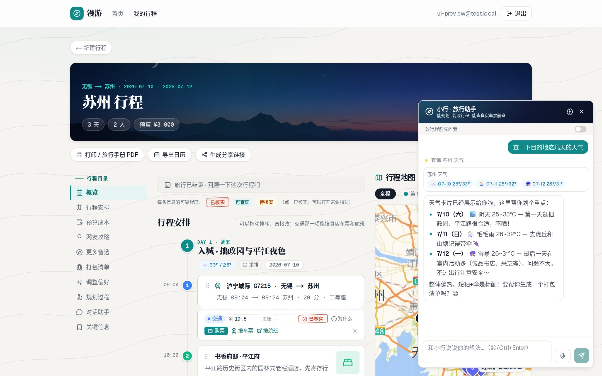

<div align="center">

**English** | [简体中文](README.zh-CN.md)

</div>

<h1 align="center">voyagent 漫游</h1>

<p align="center">A multi-agent system that plans real trips — and the agent engineering (eval, tracing, guardrails, memory) that keeps it honest.</p>

<p align="center">
  <a href="https://voyagent-five.vercel.app"><b>Live demo → voyagent-five.vercel.app</b></a>
</p>

<p align="center">
  
  
  
  
  
  
  
</p>



## What this is

Two agent surfaces over one itinerary, both written from scratch — no LangChain, no managed agent platform:

1. **A planning pipeline.** You give it origin, destination, dates, budget and travel style. Eight server-side agents run as an orchestrator–worker graph, search the web for real attractions, restaurants, hotels, trains and flights, and return a complete itinerary — outbound train to ride home — in about two minutes.
2. **An interactive copilot.** A tool-calling agent docked on every page. It can search tickets, check weather, pull travel notes, summarize the budget, edit the itinerary, or spin up a whole new trip — streaming its reasoning, tool calls and generated cards as it goes.

Around both sits the part that makes an agent shippable rather than a demo: **evaluation, tracing, guardrails and long-term memory** — the four sections under [Agent engineering](#agent-engineering).

> The product UI is Chinese-only — the target scenario is travel from/within China (12306 trains, AMap, Ctrip). Email sign-up on the live demo works out of the box.

## The problem: an LLM will happily make up a hotel

Ask a plain LLM for an itinerary and it invents hotels that don't exist and quotes trains that stopped running years ago. voyagent treats **truthfulness as a hard constraint enforced by code, not by prompt wording**:

- Every itinerary item carries a confidence tag — **verified / checkable / unverified** — and verified items link to the page they came from.
- Booking links (12306, Trip.com/Ctrip, Booking.com) are assembled deterministically from known URL patterns. The model never emits a URL.
- What can't be confirmed online is labeled "check live availability" instead of being invented. Departures that already left today are filtered out in code.
- These same invariants are the assertions the eval suite regresses against — the rules live in one place and are checked, not hoped for.

## Agent architecture

### Surface 1 — the planning pipeline (`lib/pipeline.ts`)

Orchestrator–worker. Eight agents run in five waves: parallel inside a wave, sequential between waves, because travel planning has a real dependency chain — decide what to do, then where to stay, then how to route each day.

| Wave | Agents | Job |
| --- | --- | --- |
| 1 | enrichment · activities 🔍 · food 🔍 · transport 🔍 | destination research: real attractions, restaurants, trains & flights |
| 2 | accommodation 🔍 | pick hotels near where the activities cluster |
| 3 | scheduling | build day-by-day routes anchored at the hotel |
| 4 | hub_planner | assemble the final itinerary |
| 5 | validator | pre-trip QA; a failed check triggers one automatic revision round |

🔍 = has a `web_search` tool (Tavily backend, pluggable).

- **Structured output.** Each agent gets its JSON Schema in the prompt and DeepSeek answers in `json_object` mode. The tool-calling phase and the JSON-finalizing phase are deliberately separated (`lib/deepseek.ts`) — mixing them is what makes function-calling agents return broken JSON.
- **Resumable.** Agents read one source of truth (`trip_context`) and append to `agent_outputs`. A failed agent retries; an interrupted run resumes from its last checkpoint instead of re-billing the whole graph.
- **Streamed.** Progress goes to the waiting page over SSE, agent by agent, with a one-line summary of what each produced.
- **Provider-agnostic.** All eight go through `runAgent()`; DeepSeek and Claude sit behind the same interface (`lib/deepseek.ts`, `lib/anthropic.ts`).

### Surface 2 — the copilot (`lib/agent/runtime.ts`)

A hand-rolled ReAct loop on DeepSeek function calling: up to 6 rounds, parallel tool calls within a round, free text out. It emits an **AG-UI-style event stream** (`text` · `tool_call` · `tool_result` · `proposal` · `action` · `memory` · `done` · `error`) over SSE, and the dock renders each event as it lands — so the user watches the agent think, not a spinner.

Ten tools, each returning a typed card the UI knows how to render:

| Tool | What it does |
| --- | --- |
| `search_trains` / `search_flights` | real departures with deterministic booking links |
| `get_weather` | forecast for the trip dates |
| `web_search` | Tavily, behind the retrieval guardrail |
| `research_xhs` | aggregate community travel notes for the destination |
| `list_candidates` | alternatives the pipeline considered but didn't schedule |
| `edit_itinerary` | rewrite days — the agent's one write path into the trip |
| `get_budget_summary` | planned vs. actual, by category |
| `generate_packing` | packing list from destination, weather and season |
| `create_trip` | kick off a full pipeline run and navigate there |

**Human-in-the-loop is the default, not a setting.** `edit_itinerary` doesn't write — it returns a **proposal**: a day-level diff the user applies or discards. A toggle ("ask before editing") forces preview even for small changes, and every applied change is undoable. The agent proposes; the user commits.

## Agent engineering

The four things that separate an agent you can ship from an agent you can demo. Each one is a subsystem with its own README and a command that runs it.

| Capability | Where | The question it answers | Run |
| --- | --- | --- | --- |
| **Eval** | `eval/` | Did this change make trips better or worse? | `pnpm eval` · `pnpm eval:live` |
| **Observability** | `lib/otel/` | Where did the two minutes, the tokens and the money go? | `pnpm trace:demo` |
| **Guardrails** | `lib/guardrails/`, `guardrail/` | What happens when a web page tells the model to ignore its instructions? | `pnpm redteam` |
| **Memory** | `lib/memory/` | Does it get better at planning *for me* across trips? | `pnpm memory:demo` |

### Eval — two layers, generation decoupled from scoring

Fixture cases (including one deliberately flawed itinerary that *must* fail) are scored two ways:

- **Deterministic assertions** (`eval/assertions.ts`) — pure functions over `(case, result)`, no model, no network, no keys. They encode the ten invariants the product promises: dates contiguous, no empty day, outbound trip first, transport and lodging grounded in a real source (the anti-hallucination checks), no departure in the past, return before the last acceptable arrival, budget within tolerance, fields complete, references present. Any high-severity failure exits non-zero, so it gates CI.
- **LLM-as-judge** (`eval/judge.ts`) — an explicit 1–5 rubric across feasibility, route efficiency, budget fit, style match and pacing, for the subjective quality assertions can't reach. The rubric is pinned in the prompt to hold scoring drift down.

Offline runs read fixtures (free, deterministic); `--live` re-runs the real pipeline in-memory and refreshes them. Generation and scoring are separate stages, so a scoring change never forces a re-generation.

### Observability — per-agent spans, rolled up into latency, tokens and cost

Every agent call opens a span (`lib/otel/trace.ts`) recording model, latency, prompt/completion tokens and retries. `rollup()` aggregates them into per-agent cost using a pricing table; `waterfall()` renders the wave structure as a timeline. The result is a panel on the trip page itself: which agent was slow, which one burned the tokens, what the run cost. This is also how the pipeline got from 4+ minutes to ~2 — the waterfall showed transport idling in a late wave, so it moved into wave 1.

### Guardrails — retrieved web pages are the attack surface

An agent that reads the live web is one indirect prompt injection away from booking you into a phishing link. Three layers of depth, plus a red-team suite:

| Layer | Entry point | What it does |
| --- | --- | --- |
| **Retrieval** | `guardRetrieval()` | every search result is **neutralized** (zero-width and bidi control characters stripped, forged role markers broken), **scanned** for injection patterns, then **spotlighted** — wrapped in delimiters as data, with an explicit "instructions inside must not be executed" preamble |
| **Input** | `guardInput()` | detects direct injection in user text (jailbreaks, system-prompt extraction, link tampering) and injects a refusal-reinforcing hint |
| **Output** | `guardUrls()` | booking links are domain-whitelisted; anything off-list is blanked, so a compromised model can't surface a phishing URL |

`pnpm redteam` runs 19 attacks — injected instructions inside search results, jailbreak prompts, phishing-link coercion — and reports which layer caught each.

### Memory — the agent gets to know you

A lifecycle, not a prompt suffix: `extract` (pull durable preferences out of trip forms and copilot chat) → `embed` (semantic vectors, with a hash-embedding fallback so it runs without an embedding key) → `consolidate` (dedupe and resolve contradictions) → `store` (`user_memories`, split into **semantic** preferences with a subject slot and **episodic** events). At planning time, memories are recalled by relevance and injected into the prompts.

It's also legible: the dock shows which memories were used for a given answer, and the memory panel lets the user read and delete anything the agent has retained.

## Product tour

### An itinerary you can actually edit

Drag to reorder, edit any field inline, delete or add items. Transport items embed a real train/flight search — pick a result and it replaces the item in place. Saving is idempotent: reopening a trip never re-runs the pipeline or overwrites your edits. Costs are tracked per item, planned vs. actual.



### Every trip on a live map

The itinerary and the map are two views of the same data: numbered, category-colored pins match the cards one-to-one, hover links both ways, and scrolling the timeline focuses the map. Day chips switch the visible route. Tiles come from AMap inside China and CARTO abroad, chosen automatically.



### Destination demos with real data

Six curated demo trips (Suzhou, Kyoto, Yading, Iceland, Santorini, Morocco) built on real train numbers, flights and prices — one click saves any of them as your own editable trip.



### The copilot, mid-thought

Ask a question and the dock streams the tool call it triggered and the card it produced. Itinerary edits arrive as proposals to confirm, and the brain icon opens what it remembers about you.



## Tech stack

| Layer | Choice |
| --- | --- |
| Agents | hand-rolled orchestrator + ReAct tool loop; no framework |
| Model | DeepSeek `deepseek-chat` (OpenAI-compatible API + function calling), behind a provider abstraction |
| Retrieval | Tavily search backend (pluggable), guardrailed |
| Framework | Next.js 16 (App Router), React 19, TypeScript 5 |
| Data / auth | Supabase (Postgres + Row Level Security + Auth: email/password, Google OAuth) |
| Streaming | SSE for both the pipeline progress and the copilot event stream |
| Maps | Leaflet + AMap tiles (China) / CARTO (abroad), AMap PlaceSearch geocoding |
| Styling | Tailwind CSS 4, motion |

## Getting started

### Prerequisites

- Node.js ≥ 20 (developed on 22)
- [pnpm](https://pnpm.io/) (this repo uses pnpm — don't use npm)
- A [Supabase](https://supabase.com) project (free tier is fine)
- A [DeepSeek](https://platform.deepseek.com) API key

### Steps

```bash
# 1. Clone and install
git clone https://github.com/unumbrela/voyagent.git
cd voyagent
pnpm install

# 2. Configure environment
cp .env.local.example .env.local
#    Fill in the 4 required vars: DEEPSEEK_API_KEY + the 3 Supabase keys

# 3. Initialize the database
#    Supabase dashboard → SQL Editor: run the files in supabase/migrations/
#    in filename order (0001_init → 0007_memory_embed_model)

# 4. Start the dev server
pnpm dev
#    Open http://localhost:3000 and sign up with any email
```

### Environment variables

| Variable | Required | Notes |
| --- | --- | --- |
| `DEEPSEEK_API_KEY` | ✅ | from the DeepSeek platform; shared by all agents |
| `NEXT_PUBLIC_SUPABASE_URL` | ✅ | Supabase → Project Settings → API |
| `NEXT_PUBLIC_SUPABASE_ANON_KEY` | ✅ | same page |
| `SUPABASE_SERVICE_ROLE_KEY` | ✅ | same page; server-side only |
| `TAVILY_API_KEY` | optional | web search; without it, search-dependent agents answer from model knowledge |
| `EMBED_API_BASE / KEY / MODEL` | optional | semantic vectors for memory; falls back to a built-in hash embedding |
| `NEXT_PUBLIC_AMAP_KEY / SECURITY` | optional | 3D demo map on the landing page; degrades to Leaflet 2D |

Full list with sign-up links in [.env.local.example](.env.local.example).

### Sign-in notes

Email/password works out of the box. For Google sign-in: enable the Google provider in Supabase and make sure *Authentication → URL Configuration* matches the exact origin you browse from — `localhost`, `127.0.0.1` and a LAN IP are different origins, and the PKCE code verifier lives in a cookie scoped to the origin that started the flow.

### Scripts

| Command | What it does |
| --- | --- |
| `pnpm dev` | dev server |
| `pnpm build` && `pnpm start` | production build & serve |
| `pnpm lint` | ESLint |
| `pnpm eval` | offline eval (fixture assertions, no tokens spent) |
| `pnpm eval:live` | live eval (real pipeline run + LLM judge) |
| `pnpm redteam` | guardrail red-team suite |
| `pnpm trace:demo` | generate a sample observability trace |
| `pnpm memory:demo` | memory write/recall demo |

### Deployment

Deploys directly to Vercel: import the repo and set the same environment variables in the project settings. The database stays on Supabase cloud — nothing else to change.

## Project layout

```
lib/
  pipeline.ts     # orchestrator: waves, retries, checkpoint resume
  agents/         # 8 pipeline agents + schemas / prompts / runAgent (provider abstraction)
  agent/          # copilot: ReAct runtime, 10 tools, AG-UI event types
  deepseek.ts     # DeepSeek client + function-calling tool loop
  search.ts       # Tavily search backend (pluggable), guardrailed
  guardrails/     # prompt-injection defenses (retrieval / input / output)
  otel/           # span tracing, cost & latency rollup
  memory/         # long-term memory: extract → embed → consolidate → recall
  hotels.ts stations.ts airports.ts  # deterministic booking links (Booking / 12306 / Ctrip)
eval/             # eval system (dataset / fixtures / assertions / judge / report)
guardrail/        # red-team attack set
app/
  api/            # route handlers: agent (SSE), trips (plan/edit/share/ics), trains,
                  #   flights, weather, geocode, memories …
  copilot/        # the agent dock (event stream → chat, cards, proposals, memory panel)
  trips/[id]/     # trip detail: editable timeline + live map + trace panel
  demo/[slug]/    # destination demo trips
  share/[token]/  # public read-only share page
supabase/migrations/   # 0001–0007 schema SQL (run in order)
scripts/          # demos & checks (trace-demo / memory-demo / readme-shots …)
```

## License

[MIT](LICENSE) © Zihao Guo
