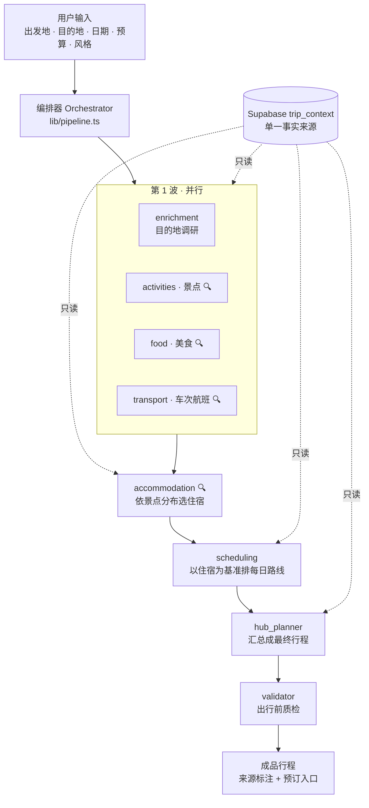

<p align="center">
  
</p>

<h1 align="center">漫游 voyagent</h1>

<p align="center">基于多智能体的旅行规划 Web 应用</p>

<p align="center">
  
  
  
  
  
  
  
</p>

---

输入出发地、目的地、日期、预算和偏好，服务端 8 个智能体分工协作，联网查询真实的景点、酒店、车次和航班，生成一份从去程排到返程的完整行程。行程里的每条信息都带来源、可以核对，交通和住宿带真实预订入口，生成后还能继续修改。

直接让大模型生成行程有一个常见问题：它会编出不存在的酒店和已停运的车次。本项目把真实性当作硬约束来实现——搜不到的信息标注「实时查询」，不编造；预订链接由代码按规则拼接（12306 / 携程 / Booking.com），不由模型生成。

## 主要功能

- **行程规划**：8 个智能体按 5 个波次执行（波内并行、波间顺序），全程约 2 分钟，进度经 SSE 实时推送到等待页；失败自动重试，中断后从断点续跑，质检不过自动修订一轮。
- **信息可溯源**：每个条目带「已核实 / 可查证 / 待核实」标签，已核实的可以点开来源网页；出发日为当天时，已发车的班次会被代码过滤。
- **行程编辑**：条目支持拖拽排序、直接改内容、增删；交通条目内嵌搜车票 / 搜航班，查到真实班次一键替换；保存幂等，再次打开不重跑、不覆盖修改。
- **行程地图**：Leaflet 渲染，时间轴与地图双向联动、滚动聚焦；国内用高德瓦片、出境自动切 CARTO；按天切换当日路线。
- **数字人助手「小行」**：three.js 实时 3D 形象 + 云 TTS + 口型同步，语音或文字对话完成规划、改行程、查票、查天气；改动先出提案卡片，用户确认后才生效。
- **其他**：公开分享链接、ics 日历导出、旅行手册 PDF 打印、打包清单、预算与实际花费记账、网友攻略聚合、示例行程一键载入。
- **HCI 研究支持**：交互埋点 + 内建 SUS / NASA-TLX / 信任量表问卷（`/study`），配分析脚本。
- **工程配套**：评估闭环（eval）、调用链追踪（otel）、提示注入护栏（guardrails）、长期记忆（memory），见下文。

## 架构

采用 orchestrator–worker 结构：编排逻辑在服务端自持（`lib/pipeline.ts`），不依赖托管 Agent 平台。



> 🔍 = 挂载了 `web_search` 工具（Tavily 后端，可替换）。

要点：

- **波内并行、波间顺序**：旅行规划有依赖链（先定玩什么 → 再选住哪 → 再排路线）；transport 只依赖出发地/目的地/日期，提到第 1 波并行后全流程从 4 分钟以上缩短到约 2 分钟。
- **结构化输出**：每个智能体把 JSON Schema 写进 prompt，DeepSeek 以 `json_object` 模式返回；带工具阶段与 JSON 收口阶段分离（`lib/deepseek.ts`）。
- **单一事实来源**：智能体只读 `trip_context`，产物累积写 `agent_outputs` 供下游读取，也用于断点续跑。

## 技术栈

| 层 | 选型 |
| --- | --- |
| 框架 | Next.js 16（App Router）、React 19、TypeScript 5 |
| 样式 | Tailwind CSS 4、motion 动效 |
| 数据 / 认证 | Supabase（Postgres + Row Level Security + Auth：邮箱密码 / Google OAuth） |
| 模型 | DeepSeek `deepseek-chat`（OpenAI 兼容接口 + function calling）；保留 Anthropic provider 抽象 |
| 检索 | 自建工具调用循环 + Tavily 搜索后端（可插拔） |
| 地图 | Leaflet + 高德瓦片（国内）/ CARTO（境外），高德 PlaceSearch 地理编码 |
| 数字人 | three.js（glTF 模型）+ 云 TTS + wawa-lipsync 口型同步 |

## 如何运行

### 环境要求

- Node.js ≥ 20（开发使用 22）
- [pnpm](https://pnpm.io/)（本项目用 pnpm 管理依赖，请勿用 npm）
- 一个 [Supabase](https://supabase.com) 项目（免费档即可）
- 一把 [DeepSeek](https://platform.deepseek.com) API key

### 步骤

```bash
# 1. 克隆并安装依赖
git clone https://github.com/unumbrela/voyagent.git
cd voyagent
pnpm install

# 2. 配置环境变量
cp .env.local.example .env.local
#    按下表填写，必填 4 项：DEEPSEEK_API_KEY + Supabase 三件套

# 3. 初始化数据库
#    打开 Supabase 后台 → SQL Editor，把 supabase/migrations/ 下的 SQL
#    按文件名顺序（0001_init → 0007_memory_embed_model）依次执行

# 4. 启动开发服务器
pnpm dev
#    打开 http://localhost:3000，注册一个邮箱账号即可使用
```

### 环境变量

| 变量 | 必填 | 说明 |
| --- | --- | --- |
| `DEEPSEEK_API_KEY` | ✅ | DeepSeek 平台申请，所有智能体共用 |
| `NEXT_PUBLIC_SUPABASE_URL` | ✅ | Supabase → Project Settings → API |
| `NEXT_PUBLIC_SUPABASE_ANON_KEY` | ✅ | 同上 |
| `SUPABASE_SERVICE_ROLE_KEY` | ✅ | 同上，仅服务端使用 |
| `TAVILY_API_KEY` | 可选 | 联网搜索；不填则相关智能体不联网、靠模型知识作答 |
| `ZENMUX_API_KEY` 等 TTS 项 | 可选 | 数字人语音；不填回退浏览器 Web Speech |
| `EMBED_API_BASE / KEY / MODEL` | 可选 | 记忆的语义向量；不填用内置哈希向量兜底 |
| `NEXT_PUBLIC_AMAP_KEY / SECURITY` | 可选 | 首页 3D 演示地图；不填自动降级 Leaflet 2D |

完整清单和申请入口见 [.env.local.example](.env.local.example)。

### 登录说明

邮箱密码注册开箱即用。若要启用 Google 登录：在 Supabase 后台开启 Google Provider，并确保 *Authentication → URL Configuration* 里的 Site URL / Redirect URLs 与实际访问地址一致（`localhost`、`127.0.0.1`、局域网 IP 互不相通——PKCE 的 code verifier 存在发起登录那个域名的 cookie 里，回调必须回到同一域名）。配置不便时用邮箱密码即可。

### 常用脚本

| 命令 | 作用 |
| --- | --- |
| `pnpm dev` | 开发服务器 |
| `pnpm build` && `pnpm start` | 生产构建与启动 |
| `pnpm lint` | ESLint 检查 |
| `pnpm eval` | 离线评测（读 fixtures 断言，不花 token） |
| `pnpm eval:live` | 在线评测（真实调用 + LLM 评审） |
| `pnpm redteam` | 护栏红队测试 |
| `pnpm trace:demo` | 生成一条可观测追踪示例 |
| `pnpm memory:demo` | 记忆写入 / 召回演示 |
| `pnpm analyze:study` | 汇总 HCI 问卷与埋点数据 |

### 部署

项目可直接部署到 Vercel：导入仓库后在项目设置里配置与本地相同的环境变量即可。数据库仍用 Supabase 云服务，无需额外改动。

## 工程配套

| 能力 | 位置 | 说明 | 运行 |
| --- | --- | --- | --- |
| 评估闭环 | `eval/` | 生成与打分解耦：离线 fixtures 断言 + 在线 LLM-as-judge，回答「改动后有没有退化」 | `pnpm eval` / `pnpm eval:live` |
| 可观测 | `lib/otel/` | span 追踪，逐智能体归集耗时 / token / 成本，行程页可视化调用链 | `pnpm trace:demo` |
| 护栏 | `lib/guardrails/`、`guardrail/` | 三道提示注入防御：清洗用户输入、检测检索网页、预订链接域名白名单；配红队测试集 | `pnpm redteam` |
| 记忆 | `lib/memory/` | 提取用户长期偏好，向量化存储与召回，跨行程复用 | `pnpm memory:demo` |

检索到的真实网页原文会进入模型上下文，这是间接提示注入的主要攻击面，护栏即为此设计。

## HCI 研究支持

本项目同时用于人机交互课程的用户评估：

- **交互埋点**：`lib/log.ts` → `POST /api/log` → `interaction_logs` 表，覆盖建行程、规划完成、应用/放弃提案、撤销、拖拽、编辑、保存等事件。
- **评估问卷**：`/study` 页内建 SUS（可用性）、NASA-TLX（任务负荷）与信任量表，作答与埋点同表存储，`pnpm analyze:study` 输出汇总。

## 目录结构

```
app/
  api/            # 路由处理器：trips（规划/编辑/分享/ics）、trains、flights、
                  #   weather、geocode、memories、tts、log、agent …
  trips/[id]/     # 行程详情：可编辑时间轴 + 行程地图 + 可观测面板
  copilot/        # 数字人助手（CopilotDock + DigitalHuman3D）
  study/          # HCI 评估问卷（SUS / NASA-TLX / 信任）
  share/[token]/  # 公开只读分享页
  demo/[slug]/    # 目的地演示行程
lib/
  pipeline.ts     # 编排器：波内并行 / 波间顺序 / 重试 / 断点续跑
  agents/         # 8 个智能体 + schemas / prompt / runAgent（provider 抽象）
  deepseek.ts     # DeepSeek 调用 + function calling 工具循环
  search.ts       # Tavily 搜索后端（可插拔）
  hotels.ts stations.ts airports.ts  # 确定性预订链接（Booking / 12306 / 携程）
  guardrails/     # 提示注入护栏
  otel/           # 追踪与成本归集
  memory/         # 长期记忆 + 向量召回
eval/             # 评测体系（dataset / assertions / judge / report）
guardrail/        # 红队测试集
supabase/migrations/   # 0001–0007 建表 SQL（按序执行）
scripts/          # 演示与走查脚本（trace-demo / memory-demo / ui-shots …）
```

## License

[MIT](LICENSE) © Zihao Guo
