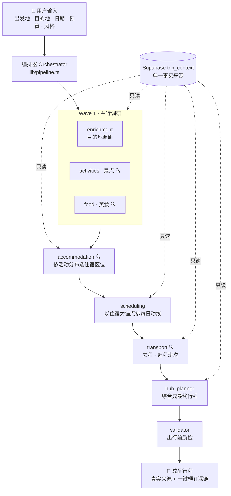

<p align="center">
  
</p>

<h1 align="center">voyagent</h1>

<p align="center">
  <b>会「取证」的多智能体 AI 旅行规划师</b><br/>
  <i>Multi-agent travel planning that never makes things up.</i>
</p>

<p align="center">
  
  
  
  
  
  
  
</p>

---

> 输入**出发地 / 目的地 / 日期 / 预算 / 风格**，服务端 **8 个专家 Agent** 分工协作、联网核实真实景点·酒店·车次航班，产出一份**每一条都能溯源、可一键预订、能边看边改**的完整行程——从去程一直排到返程。

大多数「AI 行程」会一本正经地编出不存在的酒店名和早已停运的车次。**voyagent 不会**：它把真实性当成硬约束——搜不到就标「实时查询」，**绝不虚构**，而每一个预订入口都是**确定性生成**的真实深链。

---

## ✨ 亮点

### 🕵️ 拒绝编造，条条可溯源
- 活动 / 住宿 / 交通三类 Agent 各自挂载 `web_search` 工具，模型自行决定何时联网，后端走 **Tavily**（可插拔，换 Serper/Bing 只改一个文件）。
- **酒店**必须来自真实搜索结果，每家带 `source_url`（来源）+ `booking_url`（**确定性生成**的 Booking.com 真实房态深链）；搜不到只标「实时查询」，绝不捏造酒店名或价格。
- **车次 / 航班**同理：铁路深链落到 **12306** 线路+日期余票页，航班落到**携程 / Google Flights**；未核实的一律留空 `source_url` 而不是伪造。
- **时间感知**：出发日为今天时不会推荐已发车的班次——除 prompt 约束外还有一道**确定性代码过滤**兜底，`validator` 再复核。

### 🤝 8 个专家 Agent 编排协作
复刻 Anthropic 工程博客《How we built our multi-agent research system》的 **orchestrator–worker** 范式，落到旅行这种强依赖链的场景：**波内并行、波间顺序**，全程以 Supabase `trip_context` 为唯一事实来源，用 JSON Schema 约束每个 Agent 的结构化输出。

### 🗺️ 边看边改的行程 + 交互地图
- 成品行程每个条目都能**拖拽排序、直接改内容、增删**；交通条目内嵌「🔍 搜车票 / ✈️ 搜航班」实时替换真实班次。
- **交互式 Leaflet 地图**（无需 key 的地理编码）与时间轴**双向联动**、滚动聚焦。
- 保存后**幂等**——再次打开直接读库渲染，不重跑流水线、不覆盖你的编辑。

### 🏭 生产级 Agent 工程（不止是 Demo）
一整套「让 Agent 上得了生产」的配套设施——**评估闭环 · 可观测 · 安全护栏 · 长期记忆**，详见 [下方专章](#-生产级-agent-工程)。

### 🎙️ 会说话的数字人向导
手绘 SVG 数字人 + 云 TTS（OpenAI / Azure / ElevenLabs，均未配置则回退浏览器免费 Web Speech），带口型同步，把规划过程讲给你听。

### 🔬 背后是一项 HCI 研究
本项目同时是一份**人机交互毕业设计**：研究人与多智能体协作时的**控制权分配、过程可见性、证据可信性**，内建交互埋点与 SUS / NASA-TLX / 信任量表问卷。

---

## 🏗️ 架构：Orchestrator–Worker



> 🔍 = 该 Agent 挂载了 `web_search` 工具（Tavily 后端）。

- **服务端编排，自己持有计算**：不用 Managed Agents，编排逻辑在 `lib/pipeline.ts` + `lib/agents/orchestrator.ts`。
- **波内并行、波间顺序**：旅行有强依赖链（先有活动分布，才能选住宿区位；先定住宿，才能排动线；先排动线，才能定交通），盲目并行会互相打架。
- **单一事实来源**：所有 Agent 只读 Supabase `trip_context`，产物累积写 `agent_outputs`。
- **结构化输出**：每个 Agent 把 `lib/agents/schemas.ts` 的 JSON Schema 写进 prompt，DeepSeek 以 `json_object` 模式返回规范 JSON。
- **实时进度**：`GET /api/trips/[id]/plan` 走 **SSE**，前端逐 Agent 渲染，等待页是「候机楼叙事」。
- **可靠性**：单 Agent 退避重试、`agent_outputs` 断点续跑、`validator` 质检不过则带反馈让 `hub_planner` 修订一轮再复检。

---

## 🧠 生产级 Agent 工程

回答一个 Agent 工程师必须能答的四个问题——**它变好了吗？它在干嘛？它安全吗？它记得住吗？**

| 能力 | 位置 | 一句话 | 试一下 |
| --- | --- | --- | --- |
| **📊 Eval 评估闭环** | `eval/` | 刻意解耦「生成」与「打分」：离线读 fixtures 断言 + 在线 LLM-as-judge，回答「我怎么知道 Agent 没退化」 | `pnpm eval` / `pnpm eval:live` |
| **🔭 Observability 可观测** | `lib/otel/` | OTel 风格 span 追踪，逐 Agent 的**耗时 / token / 成本**归集，页面可视化调用链 | `pnpm trace:demo` |
| **🛡️ Guardrails 护栏** | `lib/guardrails/`, `guardrail/` | 三道纵深防御 prompt injection（用户输入 / 检索网页 / 钓鱼预订链接），配红队测试集 | `pnpm redteam` |
| **🧩 Memory 记忆** | `lib/memory/` | 用户长期偏好记忆 + 向量召回，跨行程复用 | `pnpm memory:demo` |

> 检索到的**真实网页原文**会被喂给模型，这是间接 prompt injection 的头号攻击面——护栏正是为此而生：`guardInput` 洗用户输入、`guardRetrieval` 洗检索内容、URL 白名单挡钓鱼预订链接。

---

## 🔬 研究层：混合主动式人–AI 协作

系统实现是研究的技术支撑，重心在**人的一侧**——交互设计、可用性与用户评估：

- **三条研究问题**：RQ1 控制权分配、RQ2 过程可解释、RQ3 信任校准。
- **交互埋点**：`lib/log.ts` → `POST /api/log` → `interaction_logs` 表，覆盖建行程 / 规划完成 / 应用·放弃改动 / 撤销 / 拖拽 / 编辑 / 保存等关键事件。
- **评估问卷**：`/study` 页内建 **SUS**（可用性）+ **NASA-TLX**（任务负荷）+ 信任量表，作答复用同一张埋点表；`pnpm analyze:study` 出分析。
- 完整研究设计见 **[docs/HCI-改造方案.md](docs/HCI-改造方案.md)**。

---

## 🛠️ 技术栈

| 层 | 选型 |
| --- | --- |
| 框架 | Next.js 16（App Router · `proxy.ts` 中间件）、React 19、TypeScript 5 |
| 样式 | Tailwind CSS 4、`motion` 动效、双段式「暮色极光 + 暖纸正文」设计语言 |
| 数据 / 认证 | Supabase（Postgres + Row Level Security + Auth，Google OAuth / 邮箱密码） |
| 模型 | DeepSeek `deepseek-chat`（OpenAI 兼容）；保留 Anthropic provider 抽象可一键切回 Claude |
| 检索 | 自建 function-calling 工具循环 + Tavily 搜索后端（可插拔、可降级） |
| 地图 | Leaflet + 无 key 地理编码 |
| 数字人 | 手绘 SVG + 云 TTS（OpenAI / Azure / ElevenLabs）+ `wawa-lipsync` 口型同步 |

---

## 🚀 快速开始

**前置**：Node ≥ 20、[pnpm](https://pnpm.io/)、一个 [Supabase](https://supabase.com) 项目、一把 [DeepSeek](https://platform.deepseek.com) API key（Tavily / TTS 可选）。

```bash
# 1. 克隆并安装（本项目用 pnpm，勿用 npm）
git clone https://github.com/unumbrela/voyagent.git
cd voyagent
pnpm install

# 2. 配置环境变量
cp .env.local.example .env.local
#   填入 DEEPSEEK_API_KEY + Supabase 三件套（URL / anon / service_role）
#   TAVILY_API_KEY 选填：不填则相关 Agent 不联网、退回模型知识作答

# 3. 初始化数据库：把 supabase/migrations/*.sql 按序在 Supabase SQL Editor 执行
#    （0001_init → 0007_memory_embed_model）

# 4. 起服务
pnpm dev            # → http://localhost:3000
```

> ⚠️ **Google 登录排错**：PKCE 的 code verifier 存在「发起登录那个域名」的 cookie 里，回调必须回到**同一个域名**。请确保 Supabase 后台 *Authentication → URL Configuration* 的 **Site URL / Redirect URLs** 与你实际打开应用的地址（`localhost` / `127.0.0.1` / 局域网 IP 三者互不相通）一致；否则用邮箱密码登录即可绕过。

### 常用脚本

| 命令 | 作用 |
| --- | --- |
| `pnpm dev` · `pnpm build` | 开发 · 生产构建 |
| `pnpm eval` · `pnpm eval:live` | 离线断言评测 · 在线 LLM 评审 |
| `pnpm redteam` | 护栏红队测试 |
| `pnpm trace:demo` | 生成一条可观测追踪示例 |
| `pnpm memory:demo` | 记忆写入 / 召回演示 |
| `pnpm analyze:study` | 汇总 HCI 问卷与埋点 |

---

## 📁 项目结构

```
app/
  api/            # 路由处理器：trips（规划/编辑/分享/ics）、trains、flights、
                  #   weather、geocode、memories、tts、log、agent …
  trips/[id]/     # 行程详情：可编辑时间轴 + 交互地图 + 可观测面板
  copilot/        # 数字人 Copilot 对话式规划
  study/          # HCI 评估问卷（SUS / NASA-TLX / 信任）
  share/[token]/  # 公开只读分享页
lib/
  pipeline.ts     # 编排器：波内并行 / 波间顺序
  agents/         # 8 个专家 Agent + schemas / prompt / runAgent（provider 抽象）
  deepseek.ts     # DeepSeek 调用 + function-calling 工具循环
  search.ts       # Tavily 搜索后端（可插拔）
  hotels.ts stations.ts airports.ts  # 确定性预订深链（Booking / 12306 / 携程）
  guardrails/     # Prompt injection 三道护栏
  otel/           # 追踪 · 成本归集
  memory/         # 长期记忆 + 向量召回
eval/             # 评测体系（dataset / assertions / judge / report）
guardrail/        # 红队测试集
supabase/migrations/   # 0001–0007 建表 SQL
```

---

## 📄 License

[MIT](LICENSE) © Zihao Guo

<p align="center"><sub>Built with a lot of agents 🤖 · 每一条行程都能溯源</sub></p>
